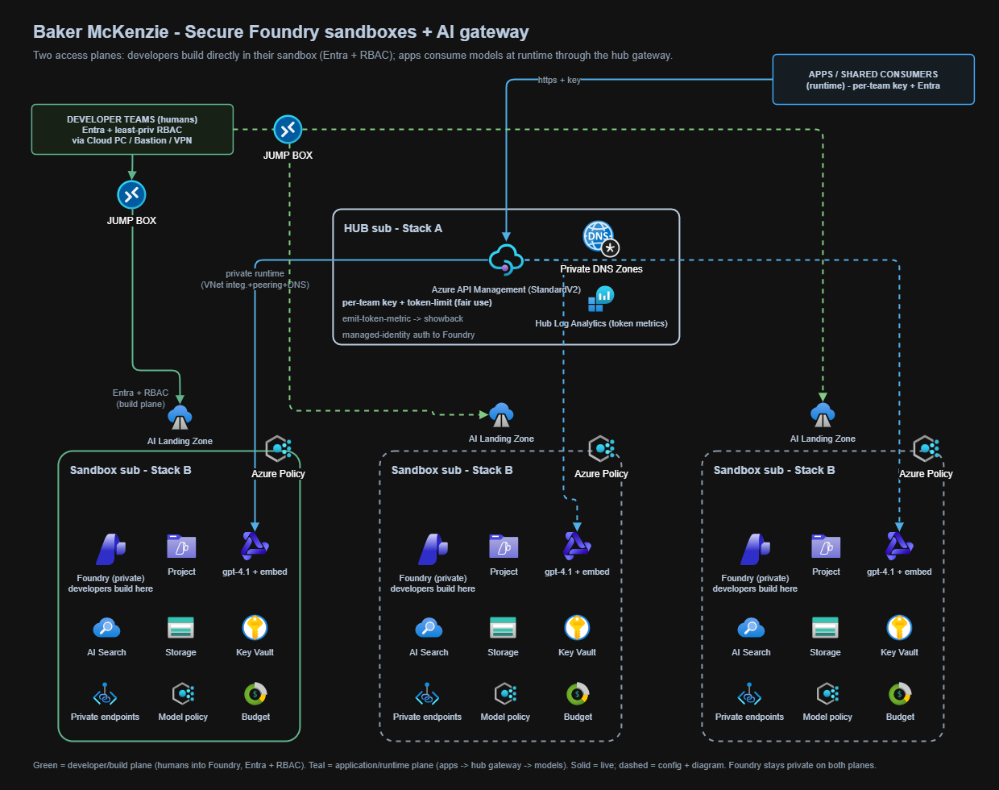
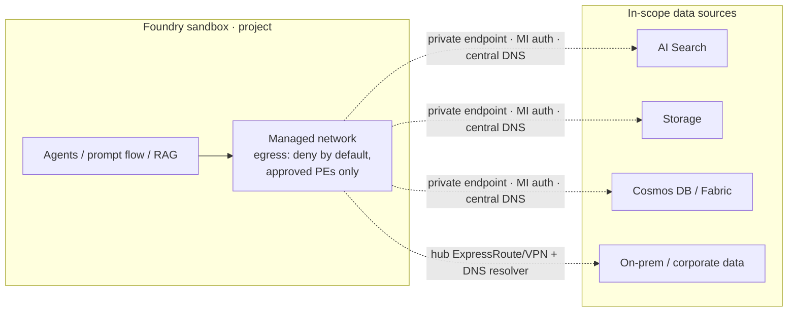
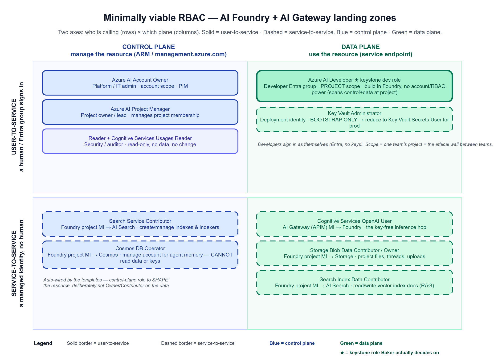

# Azure AI Landing Zone — Foundry Governance Reference

A working, Terraform-based reference implementation of the **Azure AI Landing Zone**
patterns, tailored to a subscription-per-use-case model. It shows how many governed
Azure AI Foundry sandboxes — one per team — can run securely and be fronted by a
single shared AI gateway, so teams innovate quickly while the platform keeps control
of networking, identity, model governance, policy, and cost.

It is built on the Azure AI Landing Zone Azure Verified Module and follows the
Microsoft best-practice guidance at <https://azure.github.io/AI-Landing-Zones/>.

> **Preview.** The Azure AI Landing Zone is currently in preview, and — given the pace
> of change in AI — it may use Azure services that are themselves in preview. Treat the
> module versions and specific behaviors here as a point-in-time reference; verify
> against the latest guidance before a production rollout.

---

## What this demonstrates

1. **A governed sandbox as a product.** A team gets a Foundry environment by
   completing an intake contract — owner, data classification, data residency,
   approved-model list, and budget. No sandbox exists without those decisions, so
   governance is built in from the first deployment rather than bolted on later.
2. **Isolation and residency by default.** Foundry is deployed private (private
   endpoints, no public data plane); chat models default to **DataZone** deployments
   so data stays in-geography; data resources are separated per team. This is the
   ethical-wall / client-confidentiality foundation a professional-services firm
   needs.
3. **Secure self-service for developers.** Developer teams sign in to *their own*
   sandbox Foundry directly — portal, playground, agents, prompt flow, VS Code — to
   build and experiment. "Secure" here means Microsoft Entra ID authentication (no
   shared keys), least-privilege RBAC scoped to their own project, Conditional
   Access / MFA, and private networking. The guardrails travel with the team; the
   door is not locked.
4. **A governed runtime front door (optional).** When applications or shared
   consumers need model inference, they call one hub AI gateway (Azure API
   Management) with per-team keys, per-team token limits for fair use, and per-team
   token metrics for showback. This is a *runtime* concern — it is not how a
   developer experiments, and it is not required to use a sandbox.
5. **Governance expressed as code and enforced by the platform.** The approved-model
   list is also an Azure Policy (audit first, then deny). Controls are enforced by
   the platform, independent of any individual's permissions.

---

## The two patterns

The Azure AI Landing Zone is delivered as two independently deployable patterns. A
team can adopt the Foundry pattern alone and add the gateway later.

| Pattern | What it is | When you use it |
| --- | --- | --- |
| **AI Foundry Landing Zone** | The per-team application environment: the Foundry account and project, models, data services (Storage, AI Search, Cosmos DB), Key Vault, observability, private networking. | Every team sandbox. |
| **AI Gateway Landing Zone** | A shared Azure API Management front door for centralized model access: routing, per-team keys and quotas, token metrics, and policy. | When multiple teams share capacity and you need fair-use limits, usage attribution, and centralized control. |

This reference deploys the Foundry pattern per team and fronts them with a single
gateway.

---

## Two access planes (read this before the architecture)

The most important framing: there are **two** ways into a sandbox, and they are
deliberately different.

| Plane | Who | How | Secured by |
| --- | --- | --- | --- |
| **Developer / build** (primary) | Developer teams (people) | Directly into their sandbox Foundry — portal, playground, agents, notebooks | Entra ID + least-privilege RBAC on their project, Conditional Access / MFA, private network access |
| **Application / runtime** (secondary) | Deployed apps + shared consumers | Through the hub AI gateway | Per-team subscription key + Entra, token limits, managed-identity auth, token metrics (showback) |

The gateway governs *runtime consumption*. Developers who are experimenting do **not**
go through it — they use their sandbox Foundry directly, secured by identity and
network.

---

## Architecture



- **Developer plane (left):** teams reach *their* Foundry directly and securely.
- **Runtime plane (right):** applications call models through the hub gateway.
- **Stack A** (`01-hub-ai-gateway/`) — deployed **once** into the hub subscription
  (runtime plane).
- **Stack B** (`02-foundry-sandbox/`) — deployed **per team**, each in its own
  subscription.

Because this Terraform landing-zone module deploys Foundry **private-only**, the
gateway reaches each sandbox privately over the network — a private-mesh posture that
suits a confidentiality-first environment.

---

## How developers reach a private Foundry

Because the sandbox Foundry is private (private endpoints, no public data plane),
developer access must originate from a network that can route to and resolve the
private endpoint. This is a real design decision to make with your platform team.
Choose one:

- **Cloud PC (Windows 365) or Azure Virtual Desktop**, joined to a management VNet
  peered to the sandbox — developers get a browser inside the network. Cleanest for
  "many developers, no corporate ExpressRoute."
- **Corporate ExpressRoute / VPN + Azure Private DNS Resolver** in the hub —
  developers use their own laptops; the corporate network resolves the `privatelink.*`
  zones and routes to the private endpoints. Best long-term enterprise pattern; more
  upfront networking.
- **Jump box + Azure Bastion** in the sandbox / management VNet — appropriate for a
  few operators, not a whole developer team.

Whichever path you choose, access is still gated by **Entra ID + RBAC** (below):
being on the network is necessary but not sufficient.

---

## Data source connectivity — getting data *into* Foundry, securely

If the gateway governs the outbound path (applications → models), this is the
**inbound** path Ben raised on day 1: how do sandboxes reach the data they need —
document stores, databases, client data, on-premises systems — securely and with
governance underneath. It is the "reverse flow of the gateway," and it is a
first-class design decision, not an afterthought.

### The Foundry connection model

Foundry projects reach data through typed **connections**. Each connection is a
first-class, governed object on the project. Two principles keep this governed:

- **Identity, not keys.** Connections authenticate with the project's **managed
  identity** and Entra ID wherever the target supports it, so data access is
  attributable and there is no shared secret to leak. The project identity is granted
  a **least-privilege, data-plane** role on the *specific* store (e.g. Storage Blob
  Data Contributor, Search Index Data Contributor — the service-to-service roles in
  the RBAC model above), never blanket Owner over a data estate.
- **Project-scoped.** A connection belongs to one team's project. Team A's sandbox
  cannot see Team B's data source — the same ethical wall the rest of the pattern
  enforces.

### Supported data-source / knowledge connection types

The connection types Foundry supports for bringing data and knowledge into a project
(from the official
[Add a connection](https://learn.microsoft.com/azure/foundry/how-to/connections-add)
reference; items marked *preview* are in public preview and can change):

| Connection type | Status | Created via | Brings in |
| --- | --- | --- | --- |
| **Azure AI Search** | GA | Portal or code | Vector + text retrieval over indexes (RAG). Required for Standard Agents. |
| **Azure Storage** | GA | Portal or code | Unstructured data — documents, images, files. Required for Standard Agents. |
| **Azure Cosmos DB** | Preview | Code only | Document/vector data + agent memory. Required for Standard Agents. |
| **Microsoft Fabric** | Preview | Portal (data-agent tool) or ARM | Conversational Q&A over Fabric / OneLake data. |
| **SharePoint** | Preview | Code only | Organizational documents for agent grounding. |
| **Azure Databricks** | Preview | Code only | Databricks Jobs and Genie Spaces at agent runtime. |
| **Grounding with Bing Search** | GA | Portal or code | Real-time public web grounding. |
| **Grounding with Bing Custom Search** | Preview | Code only | Tailored web grounding over a curated Bing instance. |
| **Serp** | GA | Portal or code | Search-engine results pages for real-time data. |
| **API key** | GA | Portal or code | Authenticated calls to any target API (e.g. a line-of-business data service). |
| **Custom key** | GA | Portal or code | Securely stored keys + properties for custom targets (common for LangChain). |

> There is no first-class "Azure SQL" connection type — reach a SQL/relational source
> through an **API key** or **Custom key** connection (or an agent tool), not a native
> connector. Foundry also supports connection types for **models, telemetry, and
> governance** (Azure OpenAI, OpenAI, Foundry, Application Insights, Azure Key Vault,
> Azure APIM, Model Gateway, Serverless Model, Copilot Studio) — those are not data
> sources and are out of scope for this section.

Two governance facts worth calling out:

- **Creation is a privileged action.** Adding a connection requires **Foundry User**,
  **Foundry Owner**, or Azure **Contributor** on the project/resource — it is not
  something every developer can do unilaterally.
- **Private connected resources need a private endpoint.** If a connected store has
  public network access disabled, Foundry reaches it only through a **private endpoint**
  in your VNet (resolved via the central Private DNS below) — the same private-ingress
  model this pattern already uses. Note that cross-subscription connections are **not**
  supported for *model deployment* (Foundry / Azure OpenAI).

### The private ingress path

Data flows to Foundry over the **private network**, not the public internet:

1. **Private endpoints on the data sources.** Each in-scope store (Storage, AI Search,
   Cosmos DB, etc.) is fronted by a private endpoint and resolved through the
   **central Private DNS** described above — the same foundation that lets the gateway
   resolve Foundry.
2. **Foundry managed-network egress control.** Foundry supports a managed virtual
   network that governs outbound access from agents and prompt flows. Configured in its
   **allow-only-approved-outbound** mode, outbound is denied by default and only
   **approved private-endpoint targets** (and, where needed, explicit FQDN allow-lists)
   are permitted — so agents cannot reach arbitrary destinations. This mode is a
   configuration choice; select it for confidentiality-sensitive workloads.
3. **On-premises and corporate data** are reached through the hub over
   ExpressRoute / VPN, with the hub's Private DNS Resolver resolving the private
   endpoints — so a connector to an on-prem database rides the private path, never a
   public hop.



### Governance "underneath"

- **Least-privilege data-plane RBAC** on each connected store, scoped to the project
  identity (see the RBAC model).
- **Data classification** carried in the sandbox intake, so the sensitivity of what a
  team can connect to is a decision, not a default.
- **Cataloging, lineage, and DLP** via Microsoft Purview across the connected sources.
- **Access logging** to the hub Log Analytics workspace for audit — every data-plane
  action against a connected store is attributable to the project identity.

### Discovery questions for your team

- Which data sources are in scope for the first sandbox (Applied AI), and what is the
  **highest data classification** any of them carries?
- Are those sources already **private-endpoint-enabled**, and do they resolve through
  the central Private DNS zones?
- Which live **on-premises** vs in Azure — i.e. which need the hub ExpressRoute / VPN
  path vs a direct private endpoint?
- Who **approves** a new data connection for a sandbox, and is that a governance-review
  gate in the promotion lifecycle?

## RBAC model — minimally viable, on two axes

Least privilege = grant the **narrowest plane** the job needs, at the **smallest
scope**. The templates already do this for the automatic service-to-service wiring;
the decision your teams own is the user-to-service side (which people get what).



Two axes:

- **Who is calling** — **user-to-service** (a person or Entra group signs in) vs
  **service-to-service** (a managed identity, no person in the loop).
- **Which plane** — **control plane** (Azure Resource Manager: create, configure,
  delete the resource) vs **data plane** (the resource's own endpoint: call the
  model, read a blob, query an index, read a secret).

Because Foundry runs **key-free** (local authentication disabled, managed identities
only), even "who can call the model" is an explicit, auditable role grant rather than
a shared key in an app config.

### Service-to-service (wired automatically by the templates — no person touches these)

| Role | Holder (managed identity) | Target | Plane | Purpose |
| --- | --- | --- | --- | --- |
| Cognitive Services OpenAI User | AI Gateway (APIM) managed identity | Foundry account | Data | The key-free inference hop |
| Storage Blob Data Contributor / Owner | Foundry **project** identity | Storage | Data | Project files, threads, uploads |
| Search Index Data Contributor | Foundry **project** identity | AI Search | Data | Read/write vector-index documents (RAG) |
| Search Service Contributor | Foundry **project** identity | AI Search | Control | Create/manage indexes and indexers |
| Cosmos DB Operator | Foundry **project** identity | Cosmos DB | Control | Manage the account for agent memory — **cannot read data or keys** |

Note the deliberate split: the project identity gets a control-plane role to *shape*
a resource and a scoped data-plane role only where it must *use* it — never blanket
Owner/Contributor over the data.

### User-to-service (the decision your teams own)

| Persona | Role | Scope | Plane |
| --- | --- | --- | --- |
| Developer / data scientist | **Azure AI Developer** | Project | Build (spans control + data at project scope) |
| Project owner / lead | **Foundry Project Manager** | Project | Control |
| Platform / IT admin | **Foundry Account Owner** (PIM-gated) | Account | Control |
| Security / auditor | **Reader** + **Cognitive Services Usages Reader** | Account | Read-only |

> **Role names note:** the Foundry RBAC roles were recently renamed — **Foundry User /
> Owner / Account Owner / Project Manager** were previously **Azure AI User / Owner /
> Account Owner / Project Manager** (IDs and permissions unchanged; either name may
> appear in the portal during rollout). **Azure AI Developer** was not renamed.

**Azure AI Developer** is the keystone role. It lets a developer sign in as
themselves (Entra, no keys) and build inside their project — deployments, connections,
prompt flows, evaluations, playground — **without** the power to manage the account,
change networking, or assign roles. Scoped to one team's project, it is the ethical
wall between teams. Assign it to the team's Entra ID **group**
(`developer_group_object_id` in the sandbox intake), and layer Conditional Access /
MFA / PIM on that group.

> **Hardening note (recommended before production):** the deployment identity is
> granted **Key Vault Administrator** during provisioning as a bootstrap convenience.
> For production, reduce this to **Key Vault Secrets User** (data-plane read) or
> **Key Vault Secrets Officer**, PIM-gated — it does not need standing administrative
> rights on the vault.

The full role-by-role breakdown and the recommended minimally-viable set are in
[`rbac-model.md`](rbac-model.md).

### ⚠️ Required roles for AI Search + the chat playground

> **Important.** For AI Search to actually index and query data inside Foundry (for
> example, uploading a document in the chat playground, indexing it, and asking
> questions over it), the **AI Search service's own managed identity** needs access to
> the storage account. The AI Landing Zone module grants the **Foundry project**
> identity access to storage and Search, but it does **not** grant the **Search
> service's** identity access — so indexing fails until that role is added (verified
> against a live deployment).

| # | Scope | Role | Assigned to | Why | Handled by |
| --- | --- | --- | --- | --- | --- |
| 1 | Storage account | **Storage Blob Data Contributor** | **AI Search** service managed identity | The indexer reads source blobs and writes back during integrated vectorization | ✅ **Codified** — [`02-foundry-sandbox/search-storage-rbac.tf`](02-foundry-sandbox/search-storage-rbac.tf) (`grant_search_service_storage_access`, default `true`) |
| 2 | Storage account | **Storage Blob Data Reader** | **Foundry project** identity | The project reads source blobs | ✅ Usually covered — the module already grants the project **Contributor** (a superset) on its own storage |
| 3 | Storage account | **Storage Blob Data Contributor** | **your user account** | Only if you upload files **directly** to the storage account outside the Foundry portal | ⚠️ Manual — never auto-granted (the deployment can't know the human) |

**How #1 is codified.** `search-storage-rbac.tf` discovers the sandbox's search
services and storage accounts, then grants each Search service's managed identity
`Storage Blob Data Contributor` on each storage account. Because the Search identity
is created by the module, it is resolved via data lookup and applied on a **reconciling
`terraform apply`** — the same two-pass model this repo already uses to register a
sandbox behind the gateway (deploy the sandbox, then re-apply). On a brand-new resource
group, deploy once with `grant_search_service_storage_access = false`, then set it
`true` and re-apply. A Search service must have a **system-assigned managed identity**
and **RBAC** enabled to be granted; services without one are skipped (enable the
identity first).

**#3 (direct upload) stays manual** — grant it to yourself only if you upload files to
the storage account outside the Foundry portal:

```bash
STORAGE_ID=$(az storage account show -g <rg> -n <storage-account> --query id -o tsv)
az role assignment create --assignee "$(az ad signed-in-user show --query id -o tsv)" \
  --role "Storage Blob Data Contributor" --scope "$STORAGE_ID"
```

---

## Governance and controls enforced

Everything below is enforced by the two stacks as deployed. The effects shown are the
defaults used in the reference `applied-ai` sandbox.

### Model governance — Azure Policy

- Built-in policy *"Azure Machine Learning Deployments should only use approved
  Registry Models"* — Foundry model deployments use the Azure Machine Learning
  resource provider, so this governs Foundry.
- **Scope:** the sandbox resource group, assigned per sandbox.
- **Restricts** model deployments to approved publishers, derived from the intake
  `allowed_models` list (reference: `gpt-4.1`, `text-embedding-3-large`); optionally
  pinnable to exact model versions.
- **Effect:** starts in **Audit** (teams learn what they need, violations are flagged
  not blocked); flip to **Deny** to hard-block unapproved models once the catalog is
  agreed. In production, assign this class of policy at the management-group level so
  it applies to every sandbox subscription and overrides even a subscription Owner.

### Data residency

Chat models deploy as **DataZoneStandard**, keeping inference within the geographic
data zone — the ethical-wall answer for client-confidential matters. The deployment
SKU is governed by the module, not left to the team.

### Content safety (Responsible AI)

The Foundry account is provisioned with Azure AI Content Safety available (prompt
shields, groundedness, protected-material checks) as the baseline responsible-AI
control surface.

### Network and data-plane controls

Foundry and its data services are private (private endpoints, no public data plane).
Access is via managed identity and Entra ID RBAC — no shared keys anywhere.

### Cost guardrail

Each sandbox includes a resource-group budget (reference: $500/month) with alerts at
80% and 100% of actual spend; production sandboxes add a forecasted-overspend alert.
This is the per-sandbox half of showback; the gateway adds per-team token metrics.

### Gateway governance (per team, at the AI gateway)

Applied as an Azure API Management policy on each team's API:

- **Managed-identity authentication** to the private Foundry — callers never hold a
  Foundry key.
- **Backend routing** to that team's Foundry only (isolation at the gateway).
- **Per-team token limit** for fair use — over-limit calls return HTTP 429.
- **Per-team token metrics** emitted to the hub Log Analytics workspace for showback.
- **Subscription key required** — the key is the per-team access boundary; a request
  without one returns HTTP 401.

### Governance posture summary

| Control | Where | Reference effect | Production move |
| --- | --- | --- | --- |
| Approved models only | Azure Policy on sandbox RG | Audit | Flip to Deny; assign at management group |
| Data residency | Model deployment SKU | DataZoneStandard | Keep; per data class |
| Content Safety | Foundry account | Enabled | Add required RAI review gate |
| Private networking + DNS | Module posture + hub DNS | Private-only | Policy-managed DNS at management group |
| Identity, not keys | RBAC + gateway managed identity | Enforced | PIM / Conditional Access on the groups |
| Per-team token ceiling | Gateway policy | ~1k TPM → 429 | Tune per team / SLA |
| Per-team showback | Gateway token metrics → Log Analytics | Enabled | Wire to cost dashboard |
| Spend guardrail | RG budget + alerts | $500/mo, 80/100% | Forecast alert in production |

---

## Centralized Private DNS: the prerequisite for the multi-sandbox gateway

The most important platform-foundation point for scaling this pattern.

**The problem:** if each sandbox creates its **own** copy of the `privatelink.*`
Private DNS zones, a second sandbox on the **same hub** cannot link its copies — Azure
allows only one zone per namespace per VNet. Per-sandbox hub linking therefore does
not scale, and the hub cannot resolve every sandbox's private Foundry, which is
exactly what the AI gateway needs.

**Microsoft best practice (Cloud Adoption Framework — "Private Link and DNS
integration at scale"):** centralize Private DNS. One set of `privatelink.*` zones,
owned by the platform / connectivity subscription, deployed once. Three components:

1. **Central Private DNS zones** in the connectivity subscription. The hub VNet and
   every spoke VNet link to this *single* set — never per-spoke copies.
2. **Azure Policy `DeployIfNotExists`** assigned at the management-group level, which
   auto-registers every new private endpoint into the central zones. Teams deploy
   freely; DNS wires itself, with no collisions.
3. **Central resolution** via a hub **Azure Private DNS Resolver** (or hub DNS /
   firewall proxy) so on-premises and cross-spoke lookups resolve the private
   endpoints.

**Prescriptive sequence for your environment:**

1. The platform team stands up the central `privatelink.*` zones once in the
   connectivity subscription.
2. Assign the DeployIfNotExists Private DNS policy at the management-group scope so
   every team's private endpoints auto-register.
3. Each Foundry sandbox registers into the central zones. Foundry, AI Search, Cosmos
   DB, Storage, and Key Vault private endpoints all resolve through the hub — and the
   AI gateway resolves every sandbox's Foundry with no collisions.

### Validated reference implementation

This pattern has been stood up and exercised end to end in a reference environment, so
it can be shown rather than only described:

- A full set of central `privatelink.*` zones (Foundry: `cognitiveservices`, `openai`,
  `services.ai`; plus `search`, Storage, `vaultcore`, Cosmos, `azurecr`, `azure-api`,
  `azconfig`), all linked to the hub VNet with registration disabled.
- A custom initiative bundling the built-in `DeployIfNotExists` policies for
  Cognitive/AI Services, AI Search, Key Vault, Storage blob, and Cosmos — each pointed
  at the corresponding central zone — assigned with a single managed identity holding
  **Network Contributor** and **Private DNS Zone Contributor**, so any new private
  endpoint auto-registers with no manual DNS wiring.
- A hub **Azure Private DNS Resolver** as the cross-network resolution front door for
  on-premises and cross-spoke lookups. In the reference environment, an on-premises
  client resolves the sandbox's private Foundry to its private IP once conditional
  forwarders point at the resolver — a live before/after proof that the private path
  works.

In production this same initiative is assigned at the **platform / connectivity
management group** so every landing-zone subscription inherits it automatically. The
mechanism is identical; only the scope moves up. This is a platform-team control, not
a per-workload one.

---

## Foundry network posture: Bicep and Terraform parity

The AI Landing Zone has one implementation in each of Bicep and Terraform, maintained
in separate repositories. Microsoft runs a formal
[feature-parity initiative](https://azure.github.io/AI-Landing-Zones/terraform-parity/)
to keep them equivalent, and that page is explicit that parity is **not yet complete**
and that networking is one of the areas being equalized (as of August 2026). So for a
given module version the two may differ — notably in how the Foundry account's network
posture is expressed:

- **Bicep** exposes network isolation as a first-class parameter and can deploy
  Foundry **public or private** (it defaults to public). Setting
  `networkIsolation = true` makes Foundry private; adding an IP allow-list gives
  private + a public allow-list.
- **This Terraform landing-zone module** (the version deployed here) sets
  `create_private_endpoints = true` and does not surface the Foundry public-access
  toggle, so the Foundry account resolves to public access disabled — effectively
  **private-only**. (Other services such as Key Vault, Storage, and AI Search *do*
  expose public toggles in Terraform — Foundry specifically does not.)

Net: in the module version used here, Foundry is private-only under Terraform, which is
why this reference uses the private-mesh path. Because the parity initiative is active,
confirm the current behavior against the parity page and the module version you deploy
before relying on this detail.

---

## Platform-enforced policy: governed (policy-locked) subscriptions

Some subscriptions inherit a management-group Azure Policy that **forces Key Vault
private-only** and cannot be overridden from inside the subscription — even an Owner
cannot re-enable public access.

Impact: the module's optional build / jump VMs cannot be provisioned in such a
subscription, because during creation they write their admin password into the private
Key Vault from the deployer's public IP, which the policy blocks. This is external
governance working as intended, not a defect, so those VMs are disabled by default in
this reference.

This is a good illustration of the model: the platform policy refuses to expose the
Key Vault regardless of operator rights — Zero Trust enforced by the platform, not by
trust. The trade-off is that environment management happens over the private network
rather than a public IP.

**Demonstrating a live data-plane action** (with the VMs disabled and Foundry
private): run it from a VM **inside a VNet where the private endpoints resolve** — for
example a small VM created in the sandbox VNet with an inline admin password (no Key
Vault write), reached via Azure Bastion. Private-endpoint FQDNs resolve automatically
because the module links the DNS zones to the sandbox VNet.

---

## Deploy

```pwsh
# 0) Pre-register the required resource providers in EACH target subscription
foreach ($rp in "Microsoft.CognitiveServices","Microsoft.MachineLearningServices","Microsoft.Search","Microsoft.Storage","Microsoft.KeyVault","Microsoft.Network","Microsoft.App","Microsoft.ApiManagement","Microsoft.Web","Microsoft.OperationalInsights","Microsoft.Authorization","Microsoft.PolicyInsights","Microsoft.DocumentDB","Microsoft.ContainerRegistry") {
  az provider register --namespace $rp
}

# 1) Hub gateway — once, into the hub subscription
cd 01-hub-ai-gateway
Copy-Item terraform.tfvars.example terraform.tfvars   # fill hub VNet + Log Analytics ids
az account set --subscription <hub-sub-id>
terraform init; terraform apply        # leave registered_sandboxes empty for now

# 2) First sandbox — into a team subscription
cd ../02-foundry-sandbox
Copy-Item terraform.tfvars.example terraform.tfvars   # fill team intake + hub VNet id
az account set --subscription <team-sub-id>
terraform init; terraform apply
terraform output register_in_stack_a   # copy this block

# 3) Register the sandbox behind the gateway — back in the hub subscription
cd ../01-hub-ai-gateway
#   paste the block into registered_sandboxes in terraform.tfvars
az account set --subscription <hub-sub-id>
terraform apply                        # minutes — adds backend/API/product/policy for the team
```

**Permissions:** each deployer needs **Contributor + User Access Administrator** on
the target subscription (User Access Administrator is required for the RBAC
assignments). For the hub↔sandbox peering you also need write access to the hub VNet's
resource group.

Adding another team later is a one-line change: a new entry in `registered_sandboxes`
plus a re-apply.

---

## Repository layout

```
baker-mckenzie-workshop/
├── 01-hub-ai-gateway/       # Stack A: shared Azure API Management front door
│   ├── main.tf              # APIM (v2) + per-team backend/API/product/key/policy + RBAC
│   ├── variables.tf         # registered_sandboxes map
│   ├── outputs.tf           # gateway URL, example call
│   └── terraform.tfvars.example
├── 02-foundry-sandbox/      # Stack B: per-team governed Foundry landing zone
│   ├── variables.tf         # the intake contract
│   ├── main.tf              # AI Landing Zone module (private Foundry, DataZone models, peering + DNS)
│   ├── governance.tf        # Azure Policy: approved-model list (audit → deny)
│   ├── search-storage-rbac.tf  # AI Search MI → Storage grant (playground indexing fix)
│   ├── cost.tf              # resource-group budget + alerts (showback)
│   ├── outputs.tf           # values to register in Stack A
│   └── terraform.tfvars.example
├── hub-central-dns/         # Centralized Private DNS reference (zones + DINE initiative)
├── rbac-model.md            # Full RBAC map (both axes) + recommended minimally-viable set
└── diagrams/                # Editable draw.io diagrams (+ rendered PNGs)
```

## Diagrams

`diagrams/` contains editable draw.io files:

- `hub-and-spoke-gateway.drawio` — the AI Gateway Landing Zone: clients → hub API
  Management → per-team private Foundry sandboxes.
- `promotion-lifecycle.drawio` — intake → governed sandbox → governance review →
  production, with the guardrails that travel at every stage.
- `foundry-gateway-rbac.drawio` — the RBAC model on both axes (user/service ×
  control/data plane).
