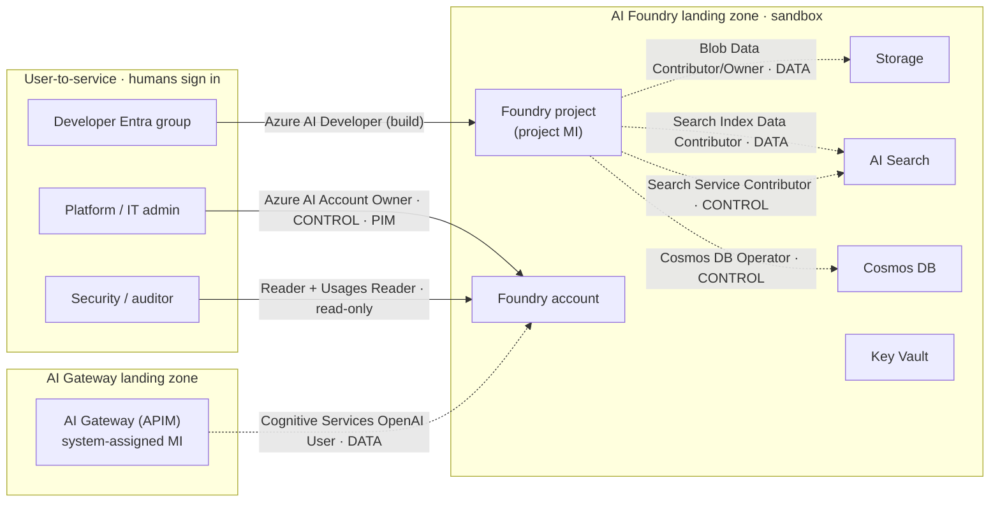

# Minimally viable RBAC - Foundry + AI Gateway landing zones

Answers the day-1 question (Adam's backchannel): *"can we address their concern
around minimally viable RBAC for Foundry environments?"* This maps every role the
two patterns deploy, on two axes:

- **Who is calling** - **user-to-service** (a human or Entra group signs in) vs
  **service-to-service** (a workload/managed identity, no human in the loop).
- **Which plane** - **control plane** (Azure Resource Manager: create, configure,
  delete the resource) vs **data plane** (the resource's own endpoint: call the
  model, read a blob, query an index, read a secret).

The point to make in the room: least privilege = give the **narrowest plane** the
job needs, to the **smallest scope**. The templates already do this for the
service-to-service wiring; the only real decision Baker owns is the **user-to-service**
side (which humans get what).

---

## Control plane vs data plane (the mental model)

| | Control plane | Data plane |
| --- | --- | --- |
| **Endpoint** | `management.azure.com` (ARM) | the resource's own endpoint (e.g. `*.openai.azure.com`, `*.search.windows.net`, `*.blob.core.windows.net`) |
| **What it does** | Create / configure / delete the resource, networking, keys listing, role assignment | Use the resource: run inference, read/write blobs, query an index, read a secret |
| **Example roles** | Owner, Contributor, Cognitive Services Contributor, Search Service Contributor, Cosmos DB Operator | Cognitive Services OpenAI User, Storage Blob Data Contributor, Search Index Data Contributor, Key Vault Administrator |
| **Key trap** | A dev with only Contributor can *reshape* the resource but, with local-auth disabled, cannot necessarily read the data | A dev with only data roles can *use* the service but cannot reconfigure or delete it |

Because Foundry runs **key-free** (local auth disabled, managed identities only), the
data plane is governed by Azure RBAC too - so "who can call the model" is an explicit,
auditable role grant, not a shared key floating in an app config.

---

## Service-to-service roles (deployed by the templates - no human touches these)

These are auto-wired by the AVM Foundry module and the gateway stack. They are already
least-privilege data roles; teams never see or manage them. **Verified live in the
`applied-ai` sandbox.**

| Role | Holder (managed identity) | Target resource | Plane | Why it exists |
| --- | --- | --- | --- | --- |
| **Cognitive Services OpenAI User** | AI Gateway (APIM) system MI | Foundry account | **Data** | Gateway calls the model on the caller's behalf - the key-free auth hop |
| **Storage Blob Data Contributor** | Foundry **project** MI | GenAI storage account | **Data** | Read/write project files, threads, uploads |
| **Storage Blob Data Owner** | Foundry **project** MI | GenAI storage account | **Data** | Owner adds POSIX/ACL control for agent file scenarios |
| **Search Index Data Contributor** | Foundry **project** MI | AI Search | **Data** | Read/write documents in vector indexes (RAG) |
| **Search Service Contributor** | Foundry **project** MI | AI Search | **Control** | Create/manage the indexes + indexers themselves |
| **Cosmos DB Operator** | Foundry **project** MI | Cosmos DB | **Control** | Manage the account for agent "enterprise memory" - notably **cannot read data keys or data** (that's the whole point of Operator vs Contributor) |

Note the deliberate split on AI Search and Cosmos: the project identity gets the
**control-plane** role to *shape* the resource and, where it needs to, a scoped
**data-plane** role to *use* it - never blanket Owner/Contributor on the data.

---

## User-to-service roles (the decision Baker owns)

### Intended by the pattern

| Role | Who | Scope | Plane | Status |
| --- | --- | --- | --- | --- |
| **Azure AI Developer** | Developer **Entra group** (per team) | Foundry **project** | Project build (spans control of project artifacts + data use) | **Pattern-ready** - set `developer_group_object_id` to the team's group; `null` in the test deploy |
| **Key Vault Administrator** | Deployment identity (bootstrap) | Key Vault | **Data** | **Deployed** - bootstrap only; should be reduced (see below) |

**Azure AI Developer** is the keystone user role: it lets a developer sign in **as
themselves** (Entra, no keys) and build inside their project - create deployments and
connections, run prompt flows and evals, use the playground - **without** the power to
manage the account, change networking, or assign roles. That's the "self-service inside
a guardrail" answer, scoped to one team's project = the ethical wall between teams.

> **Cleanup callout (be honest about this on day 2):** the deploy identity currently
> holds **Key Vault Administrator** as a bootstrap grant (the module even flags it:
> *"Review if this permission is too permissive. Can this be Secrets User instead?"*).
> For production, reduce it to **Key Vault Secrets User** (data-plane read) or
> **Secrets Officer**, PIM-gated.

### Recommended minimally-viable set (add these to the pattern)

| Persona | Role | Scope | Plane | Rationale |
| --- | --- | --- | --- | --- |
| **Developer / data scientist** | **Azure AI Developer** | Project | Build | Everything needed to build; nothing to manage the account |
| **Project owner / lead** | **Azure AI Project Manager** | Project | Control | Manage project membership + settings, still not account-wide |
| **Platform / IT admin** | **Azure AI Account Owner** (or Cognitive Services Contributor) | Account | Control | Create projects, deployments, networking - **PIM-gated** |
| **Security / auditor** | **Reader** + **Cognitive Services Usages Reader** | Account/RG | Read-only | See config + consumption without any change or data rights |
| **App / workload identity** | **Cognitive Services OpenAI User** | Account or project | Data | If an app calls Foundry directly (not via gateway), same key-free hop |

Everything above is **Entra group -> role -> scope**, PIM for the privileged ones. No
standing account-level admin for developers; no keys anywhere.

---

## Diagram

Editable: [`diagrams/foundry-gateway-rbac.drawio`](diagrams/foundry-gateway-rbac.drawio)

Legend: **solid = user-to-service**, **dashed = service-to-service**;
**CONTROL** = manage the resource (ARM), **DATA** = use the resource (endpoint).

---

## Day-2 talk track (30 seconds)

> "RBAC here breaks down two ways. First, *who's calling* - service-to-service, where
> the templates already wire managed identities with least-privilege data roles so no
> human and no key is ever in the path; and user-to-service, which is the part you own -
> who on your teams gets what. Second, *which plane* - control plane to shape the
> resource, data plane to use it. Your minimally-viable set is small: developers get
> **Azure AI Developer** on their project so they can build but not run the platform,
> admins get account-level control behind PIM, and auditors get read-only. That's the
> whole ethical-wall story - scoped to the project, enforced by Entra, no keys."
